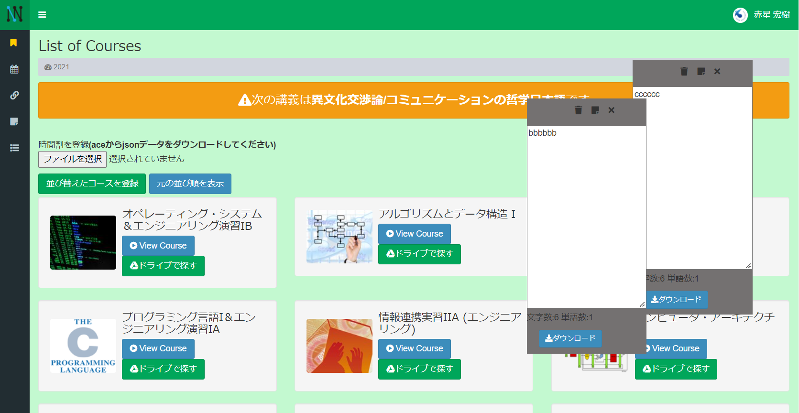

# INIAD++

東洋大学情報連携学部(INIAD)のオンライン教育システム[INIAD MOOCs](https://moocs.iniad.org/)に様々な機能を追加するGoogle Chrome™ の拡張機能です。

## 機能
* 直近の講義のお知らせ
* 講義スライドのダウンロード
* トップページに表示されているコース一覧の自由な入れ替え
* 1ページごとにメモ機能(複数可)
* メモを保存したページ一覧を表示するページ
* 外部リンク一覧
* ドライブを開くボタン
* 背景色の変更
* ヘッダおよびサイドバーの追従
(上記2つはアカウント設定ページから変更できます)
* トップに戻るボタン
* 入力文字カウント

## 注意
本ソフトウェアは、東洋大学及び東洋大学情報連携学部の公式ソフトウェア又は公式サービスとして公認、公開、頒布等しているものではありません。

本サービスにて提供する情報の正確性・妥当性につきましては細心の注意を払っておりますが、当作者はその保証をするものではありません。本サービスの利用によって利用者や第三者等にネットワーク障害等による損害、データの損失その他あらゆる不具合、不都合が生じた場合について、裁判所またはそれに準ずる機関で当作者の重過失が認められた場合を除き、当作者では一切の責任を負いません。

スライドの複製は、著作権法に違反しない範囲で行ってください。二次配布など私的利用の範囲を超えた場合は法律違反となる場合があります。スライドの複製はユーザのローカル環境で行っており、当作者サーバでの複製は行っておりません。

## ライセンス
ライセンスに関しては自由としますが、一部コード[js/download.js](js/download.js)に関してはMITライセンスが付随しているのでご注意ください。
